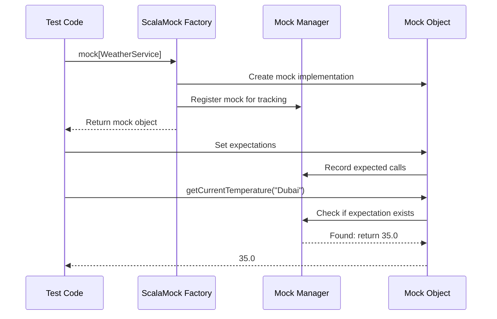

# Chapter 1: Mock

Welcome to the first chapter of our ScalaMock tutorial! Whether you're new to testing or just new to Scala, this guide will walk you through the fundamentals of mocking in a simple, friendly way.

## The Testing Challenge

Imagine you're building a weather app. It needs to fetch weather data from a remote service, process it, and display a forecast to the user. How would you test your app's logic without actually connecting to that remote service every time?

This is where **mocks** come to the rescue!

## What is a Mock?

A mock is like a stunt double in a movie. When filming a dangerous scene, actors are replaced with trained professionals who know exactly what moves to make. Similarly, in testing:

> A mock is a simulated object that mimics the behavior of real components in your system for testing purposes.

Mocks allow you to:
- Test your code in isolation
- Avoid side effects (like network calls or database operations)
- Control the test environment completely
- Verify that your code interacts correctly with dependencies

## Creating Your First Mock with ScalaMock

Let's start with a simple example. Imagine we have a `WeatherService` that our app uses:

```scala
trait WeatherService {
  def getCurrentTemperature(city: String): Double
  def getForecast(city: String): List[String]
}
```

To create a mock of this service using ScalaMock, we write:

```scala
import org.scalamock.scalatest.MockFactory
import org.scalatest.flatspec.AnyFlatSpec

class WeatherAppTest extends AnyFlatSpec with MockFactory {
  
  // Create a mock WeatherService
  val mockWeatherService = mock[WeatherService]
  
  // Test code will go here...
}
```

That `mock[WeatherService]` line is where the magic happens - it creates a simulated version of the `WeatherService` that you can control in your tests.

## Telling Your Mock What to Do

After creating a mock, you need to tell it how to behave. There are two main things to specify:

1. What method calls to expect
2. What values to return when those methods are called

Here's how you do it in ScalaMock:

```scala
// Expect the getCurrentTemperature method to be called with "New York"
// and tell it to return 25.5 degrees
(mockWeatherService.getCurrentTemperature _).expects("New York").returning(25.5)
```

Let's break down this syntax:
- `mockWeatherService.getCurrentTemperature _` - We're referencing the method (the underscore is important!)
- `.expects("New York")` - We expect this method to be called with the argument "New York"
- `.returning(25.5)` - When called, the method should return 25.5

## A Complete Example

Let's put it all together with a simple `WeatherApp` class that we want to test:

```scala
class WeatherApp(weatherService: WeatherService) {
  def describeCurrentWeather(city: String): String = {
    val temperature = weatherService.getCurrentTemperature(city)
    
    if (temperature > 30) "It's hot in " + city
    else if (temperature < 10) "It's cold in " + city
    else "The weather is pleasant in " + city
  }
}
```

Now, let's test this class with our mock:

```scala
"WeatherApp" should "describe hot weather correctly" in {
  // Create the mock
  val mockWeatherService = mock[WeatherService]
  
  // Set expectations
  (mockWeatherService.getCurrentTemperature _).expects("Dubai").returning(35.0)
  
  // Create the class under test with our mock
  val weatherApp = new WeatherApp(mockWeatherService)
  
  // Exercise the code
  val description = weatherApp.describeCurrentWeather("Dubai")
  
  // Verify the result
  assert(description == "It's hot in Dubai")
}
```

When this test runs:
1. ScalaMock creates a fake `WeatherService`
2. We tell this fake service to return 35.0 degrees when asked about Dubai
3. We pass our fake service to the real `WeatherApp`
4. `WeatherApp` calls the mock service, which returns our pre-defined value
5. We check if `WeatherApp` correctly interpreted that as "hot weather"

The beauty here is that our test doesn't need a real weather service or internet connection!

## How ScalaMock Works Under the Hood

When you call `mock[WeatherService]`, here's what happens behind the scenes:



ScalaMock uses Scala's powerful macro system and reflection capabilities to:
1. Analyze your `WeatherService` trait at compile time
2. Generate a class that implements all its methods
3. Create an instance that records calls and returns specified values

This is why ScalaMock is described as "typesafe" - if your mock doesn't match the real interface, you'll get a compile error rather than a runtime error.

## What About Verification?

One key aspect of mocks is verification. ScalaMock automatically verifies that all expected calls happened as specified. If our test code never called `getCurrentTemperature("Dubai")`, the test would fail with an error like:

```
Expected getCurrentTemperature("Dubai") once
But it was never called
```

This ensures your code is interacting with its dependencies correctly.

## When to Use Mocks

Mocks are especially useful when testing code that depends on:
- External services (APIs, databases)
- Components with side effects (sending emails, logging)
- Hard-to-reproduce scenarios (error conditions, timeouts)
- Slow operations you don't want to run in tests

## Conclusion

In this chapter, you've learned:
- What mocks are and why they're useful in testing
- How to create a mock using ScalaMock's `mock[Type]` syntax
- How to set expectations for method calls
- How to make mocks return specific values
- How ScalaMock works behind the scenes

Mocks allow you to isolate parts of your code for testing, making your tests faster, more reliable, and more focused. They're like trained actors following your script - you decide what methods get called and how they respond.

In the next chapter, [Stub](02_stub_.md), we'll explore a related concept that focuses more on providing predefined responses rather than verifying interactions. While mocks and stubs are similar, understanding the differences will help you choose the right tool for your testing needs.

Happy testing!

---

Generated by [AI Codebase Knowledge Builder](https://github.com/The-Pocket/Tutorial-Codebase-Knowledge)