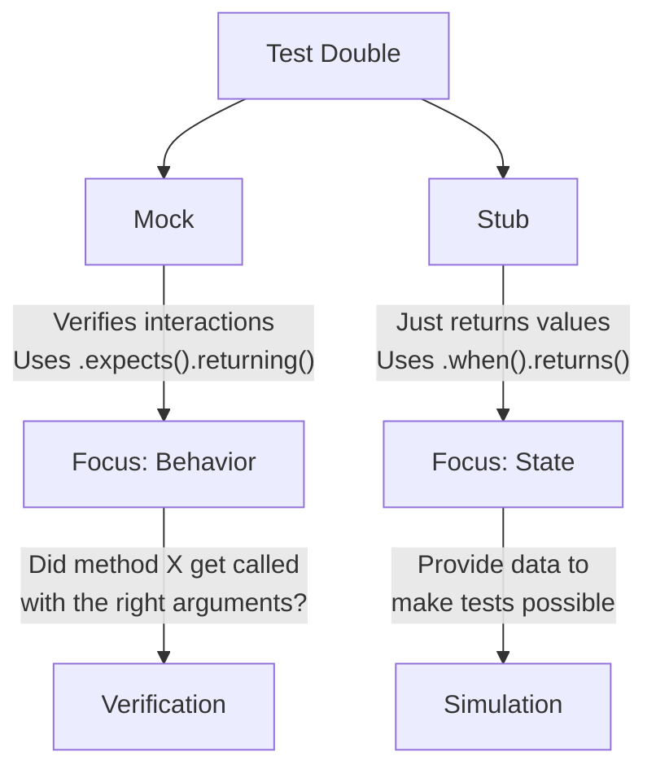
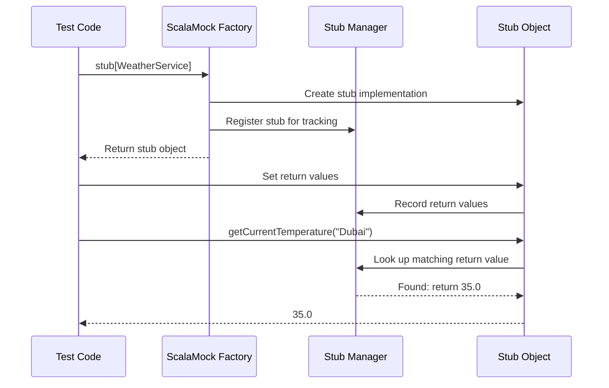

# Chapter 2: Stub

In the [previous chapter on Mock](01_mock_.md), we learned how to create test doubles that can verify interactions with your code. Now, let's explore a simpler concept: stubs.

## From Verification to Simple Responses

Imagine you're testing your weather app again. Sometimes you don't care about verifying exactly how your code interacts with the weather service—you just need it to return some predefined data so you can test other parts of your application.

This is where **stubs** come to the rescue!

## What is a Stub?

> A stub is a simplified test double that focuses on returning pre-defined values rather than verifying behavior.

Think of a stub like an answering machine with pre-recorded messages. When someone calls, it always gives the same responses without caring who called or how many times.

While a [mock](01_mock_.md) is like a detailed note-taker that records and verifies every interaction, a stub is much more relaxed—it just provides the answers you need without asking questions.

## When to Use Stubs

Use stubs when:
- You only need to provide test data
- You don't care about verifying method calls
- You want to simulate specific scenarios or responses
- You're focusing on testing the behavior of the code that consumes the stub

## Creating Your First Stub with ScalaMock

Let's revisit our `WeatherService` example:

```scala
trait WeatherService {
  def getCurrentTemperature(city: String): Double
  def getForecast(city: String): List[String]
}
```

To create a stub instead of a mock, we use the `stub` keyword:

```scala
import org.scalamock.scalatest.MockFactory
import org.scalatest.flatspec.AnyFlatSpec

class WeatherAppTest extends AnyFlatSpec with MockFactory {
  
  // Create a stub WeatherService
  val stubWeatherService = stub[WeatherService]
  
  // Test code will go here...
}
```

That one word change from `mock[WeatherService]` to `stub[WeatherService]` makes a big difference in how ScalaMock behaves!

## Setting Up Return Values

With stubs, we focus on defining what values our methods should return. The syntax is slightly different from mocks:

```scala
// Tell the stub to return 25.5 degrees when asked about "New York"
(stubWeatherService.getCurrentTemperature _).when("New York").returns(25.5)

// We can also set up multiple responses
(stubWeatherService.getForecast _).when("New York").returns(
  List("Sunny", "Partly Cloudy", "Rainy")
)
```

Let's break down this syntax:
- `stubWeatherService.getCurrentTemperature _` - We're referencing the method
- `.when("New York")` - When the method is called with "New York"
- `.returns(25.5)` - It should return 25.5

Notice we use `.when().returns()` instead of the `.expects().returning()` we used with mocks. This subtle difference highlights that stubs don't have expectations about being called—they just provide answers when needed.

## A Complete Example

Let's test our `WeatherApp` class using a stub:

```scala
"WeatherApp" should "describe hot weather correctly using a stub" in {
  // Create the stub
  val stubWeatherService = stub[WeatherService]
  
  // Set up return values
  (stubWeatherService.getCurrentTemperature _).when("Dubai").returns(35.0)
  (stubWeatherService.getCurrentTemperature _).when("Stockholm").returns(5.0)
  
  // Create the class under test with our stub
  val weatherApp = new WeatherApp(stubWeatherService)
  
  // Exercise the code with different cities
  val hotDescription = weatherApp.describeCurrentWeather("Dubai")
  val coldDescription = weatherApp.describeCurrentWeather("Stockholm")
  
  // Verify the results
  assert(hotDescription == "It's hot in Dubai")
  assert(coldDescription == "It's cold in Stockholm")
}
```

In this test:
1. We create a stub `WeatherService`
2. We set up return values for different cities
3. We pass the stub to our real `WeatherApp`
4. We test multiple scenarios with different inputs
5. We assert that our app behaves correctly based on the stubbed data

Notice that we don't care how many times the methods are called or in what order—we just provide the necessary data for our test.

## Stub vs. Mock: What's the Difference?

Let's clarify the main differences between stubs and mocks:



| Feature | Mock | Stub |
|---------|------|------|
| Primary purpose | Verify behavior | Provide test data |
| Syntax | `mock[Type]` | `stub[Type]` |
| Method setup | `.expects().returning()` | `.when().returns()` |
| Verification | Automatic (fails if expectations not met) | None (doesn't care if methods called) |
| Best for | Testing interactions between components | Testing component behavior with controlled inputs |

## Wildcards and Matchers with Stubs

Just like with mocks, you can use wildcards and matchers when setting up your stubs:

```scala
// Return the same temperature for any city
(stubWeatherService.getCurrentTemperature _).when(*).returns(22.0)

// Use a matcher to match city names starting with "New"
(stubWeatherService.getCurrentTemperature _)
  .when(where { city: String => city.startsWith("New") })
  .returns(20.0)
```

This makes your stubs more flexible when you don't need to match exact values.

## How Stubs Work Under the Hood

When you create a stub in ScalaMock, here's what happens behind the scenes:



The key difference from mocks is that stubs don't record or verify expectations about being called—they simply store mappings from inputs to outputs and return the appropriate values when called.

## Advanced: Combining Stubs and Mocks

Sometimes you might want to use both stubs and mocks in the same test. You can even convert a stub to a mock for verification:

```scala
// Start with a stub for setup
val weatherService = stub[WeatherService]
(weatherService.getCurrentTemperature _).when("New York").returns(25.5)

// Do something with the stub...
val weatherApp = new WeatherApp(weatherService)
weatherApp.describeCurrentWeather("New York")

// Now convert to a mock for verification
(weatherService.getCurrentTemperature _).verify("New York")
```

This technique lets you have the best of both worlds—the simplicity of stubs with the verification capabilities of mocks when needed.

## Real-World Use Case: Testing a Data Processor

Let's see a more realistic example. Imagine we have a data processor that needs weather data:

```scala
class WeatherDataProcessor(weatherService: WeatherService) {
  def calculateAverageTemperature(cities: List[String]): Double = {
    val temperatures = cities.map(city => 
      weatherService.getCurrentTemperature(city))
    
    temperatures.sum / temperatures.size
  }
  
  def getWarmestCity(cities: List[String]): String = {
    cities.maxBy(city => weatherService.getCurrentTemperature(city))
  }
}
```

We can test this with a stub:

```scala
"WeatherDataProcessor" should "calculate average temperature correctly" in {
  // Create the stub
  val stubWeatherService = stub[WeatherService]
  
  // Set up return values
  (stubWeatherService.getCurrentTemperature _).when("New York").returns(20.0)
  (stubWeatherService.getCurrentTemperature _).when("London").returns(15.0)
  (stubWeatherService.getCurrentTemperature _).when("Tokyo").returns(25.0)
  
  // Create the processor with our stub
  val processor = new WeatherDataProcessor(stubWeatherService)
  
  // Calculate average temperature
  val average = processor.calculateAverageTemperature(
    List("New York", "London", "Tokyo")
  )
  
  // Verify the result (20 + 15 + 25) / 3 = 20
  assert(average == 20.0)
}
```

This test focuses on whether our processor calculates the average correctly, not on how it interacts with the weather service.

## Conclusion

In this chapter, you've learned:
- What stubs are and how they differ from mocks
- How to create stubs using ScalaMock's `stub[Type]` syntax
- How to set up return values using `.when().returns()`
- When to use stubs instead of mocks
- How stubs work behind the scenes

Stubs are like quiet helpers that provide the data your code needs for testing, without the verification overhead of mocks. They're perfect when you just need to control the inputs to your system under test.

In the next chapter, [Expectations-First Style](03_expectations_first_style_.md), we'll dive deeper into one of the two major styles of using mocks in ScalaMock, where you set up all your expectations before exercising your code.

Happy testing!

---

Generated by [AI Codebase Knowledge Builder](https://github.com/The-Pocket/Tutorial-Codebase-Knowledge)