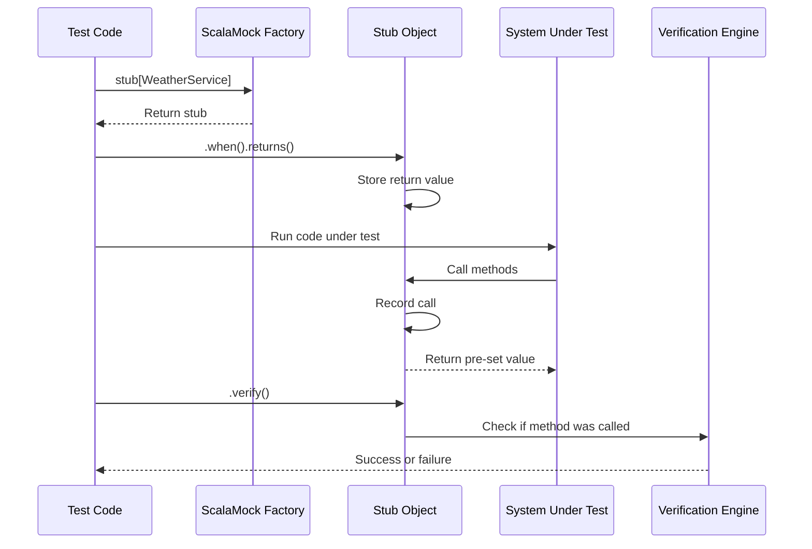

# Chapter 4: Record-then-Verify Style

In the [previous chapter on Expectations-First Style](03_expectations_first_style_.md), we explored how to set up all our expectations before running our test code. Now, let's look at an alternative approach that offers more flexibility: the Record-then-Verify Style.

## A More Flexible Approach to Testing

Imagine you're making a documentary instead of a scripted movie. Rather than planning every scene in advance, you film what happens naturally and then review the footage afterward to see if it captured what you needed. This is the essence of Record-then-Verify style testing.

> **Record-then-Verify Style** is an approach where you set up return values first, run your code, and then verify the interactions afterward. It's similar to frameworks like Mockito in the Java world.

This style creates more flexible tests that focus on verifying outcomes rather than prescribing exact sequences of interactions.

## When to Use Record-then-Verify Style

This approach is particularly useful when:

- You care more about *if* certain interactions happened than their exact order
- Your test scenario is complex with many potential paths
- You want to verify only specific interactions, not every single call
- You prefer a more relaxed testing style that resembles how Mockito works

## Understanding the Record-then-Verify Flow

Let's understand the basic flow:

1. **Record**: Set up stubs with return values using `when`/`returns`
2. **Run**: Exercise your code under test
3. **Verify**: Check if the expected methods were called with `verify`

This differs from the Expectations-First style, where you set up strict expectations before running your code.

## Basic Syntax: How to Use Record-then-Verify

Let's revisit our weather service example:

```scala
trait WeatherService {
  def connect(): Boolean
  def getCurrentTemperature(city: String): Double
  def disconnect(): Unit
}

class WeatherMonitor(weatherService: WeatherService) {
  def getTemperatureReport(city: String): String = {
    if (weatherService.connect()) {
      val temp = weatherService.getCurrentTemperature(city)
      weatherService.disconnect()
      s"The temperature in $city is $temp°C"
    } else {
      "Connection error"
    }
  }
}
```

Here's how we'd test it using Record-then-Verify style:

```scala
import org.scalamock.scalatest.MockFactory
import org.scalatest.flatspec.AnyFlatSpec

class WeatherMonitorTest extends AnyFlatSpec with MockFactory {
  
  "WeatherMonitor" should "connect, get temperature, and disconnect" in {
    // Create a stub (not a mock)
    val weatherService = stub[WeatherService]
    
    // Set up return values (the "Record" phase)
    (weatherService.connect _).when().returns(true)
    (weatherService.getCurrentTemperature _).when("New York").returns(22.5)
    
    // Create the class under test
    val monitor = new WeatherMonitor(weatherService)
    
    // Run the code under test
    val report = monitor.getTemperatureReport("New York")
    
    // Verify interactions happened (the "Verify" phase)
    (weatherService.connect _).verify()
    (weatherService.getCurrentTemperature _).verify("New York")
    (weatherService.disconnect _).verify()
    
    // Verify the result
    assert(report == "The temperature in New York is 22.5°C")
  }
}
```

Let's break down the key parts:

1. We use `stub[WeatherService]` instead of `mock[WeatherService]`
2. We set up return values with `.when().returns()` syntax instead of `.expects().returning()`
3. After running our code, we verify interactions with `.verify()`

## Setting Up Return Values

The syntax for setting up return values is similar to stubbing:

```scala
// Set up a simple return value
(weatherService.connect _).when().returns(true)

// For methods with parameters
(weatherService.getCurrentTemperature _).when("New York").returns(22.5)

// You can set up multiple return values for different arguments
(weatherService.getCurrentTemperature _).when("London").returns(18.0)
(weatherService.getCurrentTemperature _).when("Tokyo").returns(28.0)

// For methods that don't return values, you don't need .returns()
// Just set up the stub so it doesn't do anything
(weatherService.disconnect _).when()
```

## Verifying Interactions

After running your code, you verify that specific interactions happened:

```scala
// Verify that connect() was called (with no arguments)
(weatherService.connect _).verify()

// Verify that getCurrentTemperature was called with "New York"
(weatherService.getCurrentTemperature _).verify("New York")

// You can verify a call was made with any argument using *
(weatherService.getCurrentTemperature _).verify(*)

// Or use matchers for more complex matching
(weatherService.getCurrentTemperature _).verify(where { city: String => 
  city.startsWith("New") 
})
```

By default, `.verify()` checks that the method was called at least once with the specified arguments. You can be more specific about the number of calls:

```scala
// Verify called exactly once (same as just .verify())
(weatherService.disconnect _).verify().once()

// Verify called exactly twice
(weatherService.getCurrentTemperature _).verify("New York").twice()

// Verify called at least once
(weatherService.getCurrentTemperature _).verify("New York").atLeastOnce()

// Verify called at most twice
(weatherService.getCurrentTemperature _).verify("New York").atMostTwice()

// Verify called exactly 3 times
(weatherService.getCurrentTemperature _).verify("New York").exactly(3)
```

## A More Complex Example

Let's look at a more complex example involving a weather alert system:

```scala
trait WeatherAlertService {
  def checkHazards(city: String): List[String]
  def issueAlert(city: String, hazard: String): String
}

class AlertManager(weatherService: WeatherService, 
                   alertService: WeatherAlertService) {
  def processWeatherAlerts(city: String): List[String] = {
    if (weatherService.connect()) {
      try {
        val temp = weatherService.getCurrentTemperature(city)
        val hazards = alertService.checkHazards(city)
        
        var alerts = hazards.map { hazard =>
          alertService.issueAlert(city, hazard)
        }
        
        // Add temperature warning if necessary
        if (temp > 35) {
          alerts = alerts :+ alertService.issueAlert(city, "extreme heat")
        } else if (temp < -10) {
          alerts = alerts :+ alertService.issueAlert(city, "extreme cold")
        }
        
        alerts
      } finally {
        weatherService.disconnect()
      }
    } else {
      List("Could not connect to weather service")
    }
  }
}
```

Now let's test it using Record-then-Verify style:

```scala
"AlertManager" should "process alerts correctly for extreme heat" in {
  // Create stubs
  val weatherService = stub[WeatherService]
  val alertService = stub[WeatherAlertService]
  
  // Set up return values
  (weatherService.connect _).when().returns(true)
  (weatherService.getCurrentTemperature _).when("Phoenix").returns(38.0)
  (alertService.checkHazards _).when("Phoenix").returns(List("drought"))
  (alertService.issueAlert _).when("Phoenix", "drought")
    .returns("Drought alert for Phoenix")
  (alertService.issueAlert _).when("Phoenix", "extreme heat")
    .returns("Heat alert for Phoenix")
  
  // Create the class under test
  val alertManager = new AlertManager(weatherService, alertService)
  
  // Run the code
  val alerts = alertManager.processWeatherAlerts("Phoenix")
  
  // Verify results
  assert(alerts == List(
    "Drought alert for Phoenix", 
    "Heat alert for Phoenix"
  ))
  
  // Verify interactions
  (weatherService.connect _).verify()
  (weatherService.getCurrentTemperature _).verify("Phoenix")
  (alertService.checkHazards _).verify("Phoenix")
  (alertService.issueAlert _).verify("Phoenix", "drought")
  (alertService.issueAlert _).verify("Phoenix", "extreme heat")
  (weatherService.disconnect _).verify()
}
```

Notice that we don't have to specify the order of calls, just that they happened. This makes the test more flexible.

## Expectations-First vs. Record-then-Verify: A Comparison

Let's compare the two styles:

```mermaid
graph TB
    A[ScalaMock Testing Styles]
    A --> B[Expectations-First]
    A --> C[Record-then-Verify]
    
    B --> D[Uses mock objects]
    B --> E[Sets all expectations before test]
    B --> F[.expects().returning()]
    B --> G[Verifies exact order]
    
    C --> H[Uses stub objects]
    C --> I[Sets return values first]
    C --> J[.when().returns()]
    C --> K[Verifies after test]
    C --> L[Order doesn't matter]
```

| Feature | Expectations-First | Record-then-Verify |
|---------|-------------------|-------------------|
| When expectations set | Before executing code | Return values before, verification after |
| Method syntax | `.expects().returning()` | `.when().returns()` and `.verify()` |
| Order importance | Strict order (unless using `inAnyOrder`) | Order doesn't matter |
| Primary focus | Specifying exact interactions | Testing outcomes |
| Feels similar to | JMock, EasyMock | Mockito |
| Test style | More rigid, script-like | More flexible, outcome-focused |

## How Record-then-Verify Works Under the Hood

When you use the Record-then-Verify style, ScalaMock handles things differently from the Expectations-First style:



Behind the scenes:

1. When you create a stub, ScalaMock creates a test double that records all method calls
2. `.when().returns()` sets up responses for specific method calls
3. As your code runs, the stub:
   - Records all method calls and their arguments
   - Returns the values you configured
4. When you call `.verify()`, ScalaMock checks the recorded calls to see if the method was called with the expected arguments

This approach gives you more flexibility since you're verifying after the fact rather than setting strict expectations upfront.

## Converting Between Styles

Interestingly, in ScalaMock you can mix styles by converting from a stub to a mock:

```scala
// Start with record-then-verify style
val service = stub[WeatherService]
(service.getCurrentTemperature _).when("New York").returns(22.5)

// Run some code
weatherApp.processCityData("New York")

// Now add a strict expectation for the next call
(service.disconnect _).expects()

// Run more code
weatherApp.cleanup()
```

This flexibility can be useful in complex testing scenarios.

## Benefits of Record-then-Verify Style

This style of testing offers several advantages:

1. **More Flexible Tests**: You don't need to know the exact order of all calls
2. **Selective Verification**: You can verify only the interactions you care about
3. **Simpler Debugging**: Sometimes easier to understand when tests fail
4. **Familiar to Mockito Users**: Makes transition easier for Java developers
5. **Good for Complex Code Paths**: Better for code with conditional logic or loops

## Common Pitfalls and Solutions

### Pitfall 1: Forgetting to Set Up Return Values

If your code calls a method you didn't set up, you'll get unexpected results:

```scala
// Missing setup for connect
// (weatherService.connect _).when().returns(true)

// This will likely fail because connect() returns false by default
val report = monitor.getTemperatureReport("New York")
```

Always make sure to set up all necessary return values.

### Pitfall 2: Verifying Too Much or Too Little

Finding the right balance in verification is important:

```scala
// Too rigid - verifies exact number of calls for everything
(weatherService.getCurrentTemperature _).verify("New York").exactly(1)

// Too loose - doesn't verify anything critical happened
// Missing verification for critical methods

// Just right - verifies critical interactions without being too strict
(weatherService.connect _).verify()
(weatherService.getCurrentTemperature _).verify("New York")
(weatherService.disconnect _).verify()
```

Focus on verifying the interactions that are critical to your test's purpose.

### Pitfall 3: Not Understanding Default Return Values

ScalaMock provides default return values for methods you don't explicitly set up:

- `Boolean` methods return `false`
- Numeric methods return `0`
- `String` methods return `""`
- `Option` methods return `None`
- Reference types return `null`

Make sure you understand these defaults to avoid confusion.

## A Real-World Example: Testing a User Service

Let's look at a more realistic example that demonstrates why Record-then-Verify might be a good choice:

```scala
trait UserRepository {
  def findById(id: String): Option[User]
  def save(user: User): Boolean
  def sendVerificationEmail(email: String): Unit
}

class UserService(repository: UserRepository) {
  def updateUserEmail(userId: String, newEmail: String): Boolean = {
    repository.findById(userId) match {
      case Some(user) =>
        val updatedUser = user.copy(email = newEmail)
        val success = repository.save(updatedUser)
        if (success) repository.sendVerificationEmail(newEmail)
        success
      case None => 
        false
    }
  }
}
```

Testing with Record-then-Verify style:

```scala
"UserService" should "update email and send verification when user exists" in {
  // Create stub
  val repository = stub[UserRepository]
  
  // Set up return values
  val existingUser = User("123", "John", "old@example.com")
  (repository.findById _).when("123").returns(Some(existingUser))
  (repository.save _).when(*).returns(true)
  
  // Create service and run code
  val service = new UserService(repository)
  val result = service.updateUserEmail("123", "new@example.com")
  
  // Verify result
  assert(result === true)
  
  // Verify critical interactions
  (repository.findById _).verify("123")
  (repository.save _).verify(where { user: User =>
    user.id == "123" && user.email == "new@example.com"
  })
  (repository.sendVerificationEmail _).verify("new@example.com")
}
```

This testing style works well here because:
1. We're more interested in verifying that certain methods were called with specific arguments
2. The exact order is less important than the fact that verification emails are sent
3. We can use matchers to verify complex arguments like the updated user

## Conclusion

Record-then-Verify style offers a more flexible approach to testing that focuses on outcomes rather than precise interactions. By setting up return values first, running your code, and then verifying interactions afterward, you create tests that are less brittle and easier to maintain.

This style is particularly valuable when testing complex code with multiple conditional paths, or when you care more about which methods were called than their exact sequence. If you're coming from Mockito in the Java world, you'll find this style familiar and intuitive.

Now that you understand both major styles of mocking in ScalaMock, in the next chapter, [Typesafe Mocking](05_typesafe_mocking_.md), we'll explore how ScalaMock provides compile-time safety to catch more errors before your tests run.

Happy testing!

---

Generated by [AI Codebase Knowledge Builder](https://github.com/The-Pocket/Tutorial-Codebase-Knowledge)