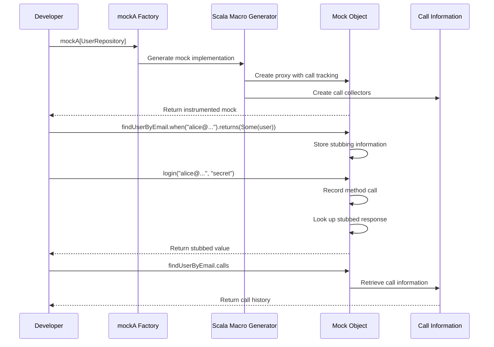

# Chapter 7: Alternative API

In the [previous chapter on Testing Framework Integration](06_testing_framework_integration_.md), we explored how ScalaMock works seamlessly with testing frameworks like ScalaTest and Specs2. Now, let's discover ScalaMock's newer, more modern approach to mocking: the Alternative API.

## A Fresh Approach to Mocking

Imagine you're a photographer who has been using a traditional film camera for years. It works well, but it's cumbersome—you need to manually adjust many settings, wait for film development, and can't immediately see if your shot is good. Then one day, you try a modern digital camera that gives you instant feedback, simpler controls, and the ability to share photos immediately.

This is similar to the difference between ScalaMock's traditional API and its newer Alternative API.

> The **Alternative API** is a modern approach to mocking in ScalaMock that provides a more concise syntax, returns data instead of throwing exceptions, and integrates nicely with functional programming styles.

## Why a New API?

The traditional mocking approach has some limitations:

1. Verbose syntax with separate expect/verify phases
2. Exception-based verification that stops tests immediately
3. Limited integration with functional programming patterns
4. Difficulty accessing data about method calls

The Alternative API solves these problems by:

1. Offering a simpler, more concise syntax
2. Returning data about interactions instead of throwing exceptions
3. Supporting functional effect types like ZIO and cats-effect IO
4. Giving you direct access to call information

## Getting Started with the Alternative API

To use the Alternative API, you'll need the appropriate dependencies:

```scala
// For the core functionality
libraryDependencies += "org.scalamock" %% "scalamock" % "7.0.0"

// For ZIO integration (optional)
libraryDependencies += "org.scalamock" %% "scalamock-zio" % "7.0.0"

// For cats-effect integration (optional)
libraryDependencies += "org.scalamock" %% "scalamock-cats-effect" % "7.0.0"
```

## Basic Usage: A Simple Example

Let's start with a simple example. Imagine we have a user authentication service:

```scala
trait UserRepository {
  def findUserByEmail(email: String): Option[User]
  def validatePassword(user: User, password: String): Boolean
}

case class User(id: String, email: String, name: String)

class AuthService(repository: UserRepository) {
  def login(email: String, password: String): Boolean = {
    repository.findUserByEmail(email) match {
      case Some(user) => repository.validatePassword(user, password)
      case None => false
    }
  }
}
```

Here's how you would test it with the Alternative API:

```scala
import org.scalamock.scalatest.MockFactory
import org.scalatest.flatspec.AnyFlatSpec
import org.scalatest.matchers.should.Matchers

class AuthServiceSpec extends AnyFlatSpec with MockFactory with Matchers {
  
  "AuthService" should "authenticate valid users" in {
    // Create a mock with the Alternative API
    val mockRepo = mockA[UserRepository]
    val user = User("123", "alice@example.com", "Alice")
    
    // Set up the mock behavior
    mockRepo.findUserByEmail.when("alice@example.com").returns(Some(user))
    mockRepo.validatePassword.when(user, "secret").returns(true)
    
    // Create the service and test it
    val service = new AuthService(mockRepo)
    val result = service.login("alice@example.com", "secret")
    
    // Verify the result
    result should be(true)
    
    // Verify the interactions
    mockRepo.findUserByEmail.calls should have size 1
    mockRepo.validatePassword.calls should have size 1
  }
}
```

Notice the key differences from the traditional API:

1. We use `mockA[UserRepository]` instead of `mock[UserRepository]`
2. Methods are accessed directly without underscores: `mockRepo.findUserByEmail`
3. We set up return values with `.when(...).returns(...)`
4. We can verify by checking the `.calls` property instead of using `.verify()`

## Understanding the Alternative API Syntax

Let's break down the key elements of the Alternative API:

### Creating Mocks

```scala
// Create a mock with the Alternative API
val mockRepo = mockA[UserRepository]
```

The `mockA` function creates a mock object using the Alternative API. The "A" stands for "Alternative".

### Setting Up Method Behavior

```scala
// Set up a method with no parameters
mockRepo.connect.when().returns(true)

// Set up a method with parameters
mockRepo.findUserByEmail.when("alice@example.com").returns(Some(user))

// Set up multiple behaviors for the same method
mockRepo.findUserByEmail.when("bob@example.com").returns(Some(bobUser))
mockRepo.findUserByEmail.when("unknown@example.com").returns(None)
```

The syntax is more concise - no underscores needed!

### Verifying Interactions

Instead of the traditional `.verify()`, you can access the `calls` property:

```scala
// Check if a method was called
mockRepo.findUserByEmail.calls should not be empty

// Check the number of calls
mockRepo.findUserByEmail.calls should have size 1

// Examine the parameters of specific calls
mockRepo.findUserByEmail.calls.head.args should be("alice@example.com")

// Check all calls match a predicate
mockRepo.findUserByEmail.calls.forall(call => 
  call.args.asInstanceOf[String].contains("@")) should be(true)
```

This data-based approach gives you much more flexibility in verification.

## A More Complex Example

Let's look at a more complete example with a weather notification service:

```scala
trait WeatherService {
  def getTemperature(city: String): Double
  def getConditions(city: String): String
}

trait NotificationService {
  def sendAlert(userId: String, message: String): Boolean
}

class WeatherNotifier(
  weatherService: WeatherService, 
  notificationService: NotificationService
) {
  def sendWeatherAlert(userId: String, city: String): Boolean = {
    val temp = weatherService.getTemperature(city)
    val conditions = weatherService.getConditions(city)
    
    val message = s"Weather in $city: $temp°C, $conditions"
    notificationService.sendAlert(userId, message)
  }
}
```

Here's how we would test it with the Alternative API:

```scala
"WeatherNotifier" should "send correct weather alerts" in {
  // Create mocks
  val mockWeather = mockA[WeatherService]
  val mockNotifier = mockA[NotificationService]
  
  // Set up mock behavior
  mockWeather.getTemperature.when("New York").returns(22.5)
  mockWeather.getConditions.when("New York").returns("Sunny")
  mockNotifier.sendAlert.when(*, *).returns(true)
  
  // Create service and exercise code
  val weatherNotifier = new WeatherNotifier(mockWeather, mockNotifier)
  val result = weatherNotifier.sendWeatherAlert("user123", "New York")
  
  // Verify result
  result should be(true)
  
  // Verify interactions
  mockWeather.getTemperature.calls should have size 1
  mockWeather.getConditions.calls should have size 1
  
  // Verify exact message content
  val alertCall = mockNotifier.sendAlert.calls.head
  alertCall.args(0) should be("user123")
  alertCall.args(1) should be("Weather in New York: 22.5°C, Sunny")
}
```

This test demonstrates how you can inspect the actual arguments passed to mock methods.

## Comparing Traditional and Alternative APIs

Let's compare the traditional and Alternative APIs side by side:

```scala
// Traditional API - Expectations-First Style
val mockService = mock[WeatherService]
(mockService.getTemperature _).expects("New York").returning(22.5)
// Later: Automatic verification

// Alternative API
val mockService = mockA[WeatherService]
mockService.getTemperature.when("New York").returns(22.5)
// Later: mockService.getTemperature.calls should have size 1
```

```scala
// Traditional API - Record-then-Verify Style
val stubService = stub[WeatherService]
(stubService.getTemperature _).when("New York").returns(22.5)
// Later: (stubService.getTemperature _).verify("New York")

// Alternative API
val mockService = mockA[WeatherService]
mockService.getTemperature.when("New York").returns(22.5)
// Later: mockService.getTemperature.calls should have size 1
```

The Alternative API combines the best of both traditional styles in a more consistent way.

## Working with Wildcard Arguments

Just like the traditional API, you can use wildcards to match any argument:

```scala
// Match any string argument
mockWeather.getTemperature.when(*).returns(25.0)

// Match specific arguments with custom predicates
mockWeather.getTemperature.when(where { city: String => 
  city.startsWith("New") 
}).returns(22.5)
```

## Handling Methods with Multiple Parameter Lists

The Alternative API makes it simpler to mock methods with multiple parameter lists:

```scala
trait DataProcessor {
  def process(data: String)(transformer: String => String): String
}

val mockProcessor = mockA[DataProcessor]

// Set up the mock behavior
mockProcessor.process.when("input")(where { fn: String => String => 
  fn("test") == "TEST" 
}).returns("processed")
```

## Integration with Functional Effects

One of the most powerful features of the Alternative API is its integration with functional effect types like ZIO and cats-effect IO.

### ZIO Integration

Here's how you can use ScalaMock with ZIO:

```scala
import org.scalamock.zio.MockFactoryZIO
import zio.test._
import zio._

trait UserRepositoryZIO {
  def findUser(id: String): ZIO[Any, Throwable, Option[User]]
}

object UserAuthServiceSpec extends ZIOSpecDefault with MockFactoryZIO {
  def spec = suite("UserAuthService")(
    test("authenticates users") {
      // Create a mock with ZIO support
      val mockRepo = mockA[UserRepositoryZIO]
      val user = User("123", "alice@example.com", "Alice")
      
      // Set up the behavior
      mockRepo.findUser.when("123").returnsZ(Some(user))
      
      // Test logic using ZIO
      for {
        service <- ZIO.succeed(new UserService(mockRepo))
        result <- service.authenticateUser("123", "password")
        _ <- ZIO.succeed(assertTrue(result))
        _ <- ZIO.succeed(assertTrue(mockRepo.findUser.calls.size == 1))
      } yield ()
    }
  )
}
```

The `.returnsZ` method returns a ZIO effect with the provided value.

### Cats-Effect Integration

Similarly, you can use ScalaMock with cats-effect:

```scala
import org.scalamock.catseffect.MockFactoryCE
import cats.effect.{IO, SyncIO}
import munit.CatsEffectSuite

trait UserRepositoryCE {
  def findUser(id: String): IO[Option[User]]
}

class UserAuthServiceSpec extends CatsEffectSuite with MockFactoryCE {
  test("authenticates users") {
    // Create a mock with cats-effect support
    val mockRepo = mockA[UserRepositoryCE]
    val user = User("123", "alice@example.com", "Alice")
    
    // Set up the behavior
    mockRepo.findUser.when("123").returnsIO(Some(user))
    
    // Test logic using IO
    for {
      service <- IO(new UserService(mockRepo))
      result <- service.authenticateUser("123", "password")
      _ <- IO(assert(result))
      _ <- IO(assert(mockRepo.findUser.calls.size == 1))
    } yield ()
  }
}
```

The `.returnsIO` method returns an IO effect with the provided value.

## How It Works Under the Hood

When you use the Alternative API, several components work together to make your testing experience seamless:



Behind the scenes, ScalaMock's Alternative API:

1. Uses Scala macros to generate mock implementations
2. Creates methods that record all calls and their arguments
3. Maintains a database of stubbed responses 
4. Provides data structures to access call information

## The Internal Implementation

The core of the Alternative API is built around a few key classes:

1. `MockA` - The factory for creating Alternative API mocks
2. `CallHandler` - Manages the behavior of mocked methods
3. `Call` - Represents a single method call with its arguments

Here's a simplified look at how a mock method is implemented:

```scala
// Conceptual implementation (simplified)
class UserRepositoryMock extends UserRepository {
  // Call handler for findUserByEmail
  val findUserByEmail = new CallHandler[String, Option[User]]
  
  // Implementation of findUserByEmail
  override def findUserByEmail(email: String): Option[User] = {
    // Record this call
    val call = Call(email)
    findUserByEmail.recordCall(call)
    
    // Return the stubbed response
    findUserByEmail.handle(email)
  }
}
```

The `CallHandler` class is responsible for:
1. Recording all calls to the method
2. Storing the stubbed behaviors
3. Finding the appropriate response for a given call
4. Providing access to call history

## Benefits of the Alternative API

The Alternative API offers several advantages:

1. **More concise syntax** - Less boilerplate, no underscores
2. **Data-based verification** - Examine calls in detail
3. **No exceptions during verification** - Tests can continue running
4. **Functional programming integration** - Works with ZIO and cats-effect
5. **Flexible verification** - Check specific aspects of calls

## Conclusion

The Alternative API represents a modern, more flexible approach to mocking in Scala. By focusing on data rather than exceptions, and providing concise syntax with functional programming integration, it makes testing easier and more powerful.

You've learned how to:
- Create mocks using `mockA[Type]`
- Set up method behaviors with `.when().returns()`
- Verify calls using the `.calls` property
- Integrate with functional effect types like ZIO and cats-effect IO

Whether you're writing basic unit tests or complex integration tests with functional effects, ScalaMock's Alternative API provides the tools you need to create clean, maintainable tests.

As you've reached the end of this tutorial series, you now have a comprehensive understanding of ScalaMock's capabilities, from basic mocking concepts to advanced features like typesafe mocking, framework integration, and the powerful Alternative API.

Happy testing!

---

Generated by [AI Codebase Knowledge Builder](https://github.com/The-Pocket/Tutorial-Codebase-Knowledge)