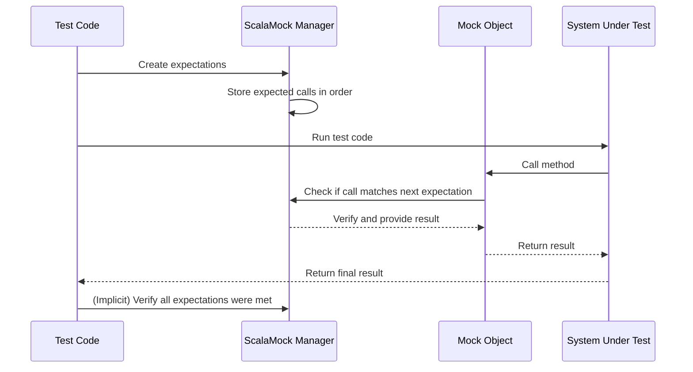

# Chapter 3: Expectations-First Style

In the [previous chapter on Stub](02_stub_.md), we explored how to create simple test doubles that return pre-defined values. Now, let's dive into one of ScalaMock's most powerful approaches to writing tests: the Expectations-First Style.

## Planning Your Test Like a Movie Script

Imagine you're directing a movie. Before filming begins, you write a detailed script specifying exactly what each actor should say and do, and in what order. The Expectations-First Style in ScalaMock follows this same principle - you define precisely what should happen before you "roll the cameras" and run your test.

> The Expectations-First Style means setting up all expected method calls and their responses **before** executing the code under test.

This approach creates a clear "contract" that your code must follow - if it deviates from the script in any way, the test fails.

## When to Use Expectations-First Style

This style is particularly useful when:

- The exact sequence of method calls matters
- You need to verify precise interactions with dependencies
- You want to ensure methods are called exactly the number of times specified
- You need a strict test that fails if anything unexpected happens

## Setting Up Expectations

Let's revisit our weather app example. This time, we'll test a more complex scenario where the order of method calls is important:

```scala
trait WeatherService {
  def connect(): Boolean
  def getCurrentTemperature(city: String): Double
  def disconnect(): Unit
}

class WeatherMonitor(weatherService: WeatherService) {
  def getTemperatureReport(city: String): String = {
    if (weatherService.connect()) {
      val temp = weatherService.getCurrentTemperature(city)
      weatherService.disconnect()
      s"The temperature in $city is $temp°C"
    } else {
      "Connection error"
    }
  }
}
```

In this example, our `WeatherMonitor` needs to:
1. Connect to the weather service
2. Get the temperature for a city
3. Disconnect from the service

Let's test this using the Expectations-First Style:

```scala
import org.scalamock.scalatest.MockFactory
import org.scalatest.flatspec.AnyFlatSpec

class WeatherMonitorTest extends AnyFlatSpec with MockFactory {
  
  "WeatherMonitor" should "connect, get temperature, and disconnect in the right order" in {
    // Create mock
    val mockWeatherService = mock[WeatherService]
    
    // Set up expectations in order
    inSequence {
      (mockWeatherService.connect _).expects().returning(true)
      (mockWeatherService.getCurrentTemperature _).expects("New York").returning(22.5)
      (mockWeatherService.disconnect _).expects()
    }
    
    // Create the class under test
    val monitor = new WeatherMonitor(mockWeatherService)
    
    // Execute the method being tested
    val report = monitor.getTemperatureReport("New York")
    
    // Verify the result
    assert(report == "The temperature in New York is 22.5°C")
  }
}
```

Let's break down what's happening here:

1. First, we create a mock of our `WeatherService`
2. We use `inSequence` to specify that these calls must happen in exactly this order
3. We set up each expected method call using `.expects()` and `.returning()`
4. Only after setting all expectations, we create our `WeatherMonitor` and call the method under test
5. We assert that the result is what we expect

## Understanding the Expectations Syntax

The core syntax for setting expectations is:

```scala
(mockObject.method _).expects(arguments).returning(value)
```

Let's break this down:
- `mockObject.method _` - The method we're setting expectations for
- `.expects(arguments)` - The arguments we expect the method to be called with
- `.returning(value)` - The value the method should return when called

You can also set expectations for methods that don't return values:

```scala
(mockWeatherService.disconnect _).expects()
```

## Expecting Specific Arguments

You can be very specific about what arguments a method should be called with:

```scala
// Expect exactly "New York"
(mockWeatherService.getCurrentTemperature _).expects("New York").returning(22.5)

// Expect any string
(mockWeatherService.getCurrentTemperature _).expects(*).returning(22.5)

// Expect a string matching specific criteria
(mockWeatherService.getCurrentTemperature _)
  .expects(where { city: String => city.startsWith("New") })
  .returning(22.5)
```

## Controlling Call Counts

You can specify how many times a method should be called:

```scala
// Expect exactly once (default)
(mockWeatherService.connect _).expects().returning(true)

// Expect exactly twice
(mockWeatherService.connect _).expects().returning(true).twice()

// Expect at most once
(mockWeatherService.connect _).expects().returning(true).atMostOnce()

// Expect at least once
(mockWeatherService.connect _).expects().returning(true).atLeastOnce()

// Expect any number of times (including zero)
(mockWeatherService.connect _).expects().returning(true).anyNumberOfTimes()
```

## Expecting Sequences and Parallel Calls

ScalaMock provides powerful ways to handle more complex interaction patterns:

```scala
// Calls must happen in this exact order
inSequence {
  (mockWeatherService.connect _).expects().returning(true)
  (mockWeatherService.getCurrentTemperature _).expects("New York").returning(22.5)
  (mockWeatherService.disconnect _).expects()
}

// Calls can happen in any order
inAnyOrder {
  (mockWeatherService.getCurrentTemperature _).expects("New York").returning(22.5)
  (mockWeatherService.getCurrentTemperature _).expects("London").returning(18.0)
}
```

## A More Realistic Example

Let's use a more realistic example to demonstrate the Expectations-First Style. Imagine we have a weather alert system:

```scala
trait WeatherAlertService {
  def checkHazards(city: String): List[String]
  def issueAlert(city: String, hazard: String): String
}

class AlertManager(weatherService: WeatherService, alertService: WeatherAlertService) {
  def processWeatherAlerts(city: String): List[String] = {
    if (weatherService.connect()) {
      try {
        val temp = weatherService.getCurrentTemperature(city)
        val hazards = alertService.checkHazards(city)
        
        val alerts = hazards.map { hazard =>
          alertService.issueAlert(city, hazard)
        }
        
        // Add temperature warning if necessary
        if (temp > 35) {
          alerts :+ alertService.issueAlert(city, "extreme heat")
        } else if (temp < -10) {
          alerts :+ alertService.issueAlert(city, "extreme cold")
        } else {
          alerts
        }
      } finally {
        weatherService.disconnect()
      }
    } else {
      List("Could not connect to weather service")
    }
  }
}
```

Now, let's test this using the Expectations-First Style:

```scala
"AlertManager" should "process alerts correctly for extreme heat" in {
  // Create mocks
  val mockWeatherService = mock[WeatherService]
  val mockAlertService = mock[WeatherAlertService]
  
  // Set up expectations
  inSequence {
    (mockWeatherService.connect _).expects().returning(true)
    (mockWeatherService.getCurrentTemperature _).expects("Phoenix").returning(38.0)
    (mockAlertService.checkHazards _).expects("Phoenix").returning(List("drought"))
    (mockAlertService.issueAlert _).expects("Phoenix", "drought").returning("Drought alert for Phoenix")
    (mockAlertService.issueAlert _).expects("Phoenix", "extreme heat").returning("Heat alert for Phoenix")
    (mockWeatherService.disconnect _).expects()
  }
  
  // Create the class under test
  val alertManager = new AlertManager(mockWeatherService, mockAlertService)
  
  // Execute the method
  val alerts = alertManager.processWeatherAlerts("Phoenix")
  
  // Verify results
  assert(alerts == List("Drought alert for Phoenix", "Heat alert for Phoenix"))
}
```

This test precisely verifies that our `AlertManager`:
1. Connects to the weather service
2. Checks the temperature for Phoenix
3. Checks for existing hazards
4. Issues an alert for the drought hazard
5. Adds an extreme heat alert because the temperature is above 35°C
6. Disconnects from the weather service

If any of these steps doesn't happen exactly as specified, the test will fail.

## How Expectations-First Style Works Under the Hood

When you use the Expectations-First Style, ScalaMock builds an internal script of expected method calls:



ScalaMock uses a concept called "call handlers" to manage these expectations. When you call `.expects()`, ScalaMock creates a handler that matches specific method calls and parameters. These handlers are stored in sequence and consulted whenever a method is called on your mock.

Behind the scenes, ScalaMock is comparing each method call against your expectations, checking:
- Is this the right method?
- Are the parameters correct?
- Is this call happening in the right order?
- Have we exceeded the expected number of calls?

## Expectations-First vs. Record-then-Verify

ScalaMock supports two main styles of mocking:

1. **Expectations-First Style** (covered in this chapter)
   - All expectations set before code execution
   - Strict ordering and verification
   - Uses `.expects().returning()`
   
2. **[Record-then-Verify Style](04_record_then_verify_style_.md)**
   - Set up returns with stubs first
   - Exercise code
   - Verify interactions afterward
   - Uses `.when().returns()` and `.verify()`

Here's a comparison:

```scala
// Expectations-First Style
val mockService = mock[WeatherService]
(mockService.connect _).expects().returning(true)
(mockService.getCurrentTemperature _).expects("New York").returning(22.5)
(mockService.disconnect _).expects()

// Run test...

// Record-then-Verify Style
val stubService = stub[WeatherService]
(stubService.connect _).when().returns(true)
(stubService.getCurrentTemperature _).when("New York").returns(22.5)

// Run test...

// Verify afterward
(stubService.connect _).verify()
(stubService.getCurrentTemperature _).verify("New York")
(stubService.disconnect _).verify()
```

The Expectations-First Style is more rigid but provides stronger guarantees about your code's behavior. You'll learn more about the Record-then-Verify Style in the [next chapter](04_record_then_verify_style_.md).

## Common Pitfalls and Solutions

### Pitfall 1: Missing Underscore

A common error is forgetting the underscore after the method name:

```scala
// Incorrect - will not compile
(mockWeatherService.getCurrentTemperature).expects("New York").returning(22.5)

// Correct
(mockWeatherService.getCurrentTemperature _).expects("New York").returning(22.5)
```

The underscore is needed to reference the method itself rather than calling it.

### Pitfall 2: Setting Expectations After Execution

All expectations must be set before the code under test is executed:

```scala
// Incorrect order
val mockWeatherService = mock[WeatherService]
val monitor = new WeatherMonitor(mockWeatherService)
val report = monitor.getTemperatureReport("New York") // Calls methods on mock
// Too late to set expectations!
(mockWeatherService.connect _).expects().returning(true) // Test will fail

// Correct order
val mockWeatherService = mock[WeatherService]
(mockWeatherService.connect _).expects().returning(true) // Set up first
val monitor = new WeatherMonitor(mockWeatherService)
val report = monitor.getTemperatureReport("New York") // Then execute
```

### Pitfall 3: Overspecifying

Sometimes we're too strict in our tests:

```scala
// Too specific - test might be fragile
inSequence {
  (mockWeatherService.connect _).expects().returning(true)
  (mockWeatherService.getCurrentTemperature _).expects("New York").returning(22.5)
  (mockWeatherService.getCurrentTemperature _).expects("Boston").returning(18.0)
  (mockWeatherService.disconnect _).expects()
}

// More flexible when order doesn't matter between temperature checks
inSequence {
  (mockWeatherService.connect _).expects().returning(true)
  
  inAnyOrder {
    (mockWeatherService.getCurrentTemperature _).expects("New York").returning(22.5)
    (mockWeatherService.getCurrentTemperature _).expects("Boston").returning(18.0)
  }
  
  (mockWeatherService.disconnect _).expects()
}
```

## Conclusion

The Expectations-First Style in ScalaMock provides a powerful way to define exact expectations for how your code should interact with its dependencies. By specifying all expected method calls beforehand, you create a strict contract that your code must follow, ensuring it behaves exactly as intended.

This style is particularly valuable when the precise order and number of method calls are important. It provides strong guarantees but requires careful planning of your test scenarios.

In the next chapter, [Record-then-Verify Style](04_record_then_verify_style_.md), we'll explore a more flexible approach that might be better suited for certain testing scenarios. This alternative style allows you to set up return values first, run your code, and then verify interactions afterward - similar to frameworks like Mockito.

Happy testing!

---

Generated by [AI Codebase Knowledge Builder](https://github.com/The-Pocket/Tutorial-Codebase-Knowledge)
