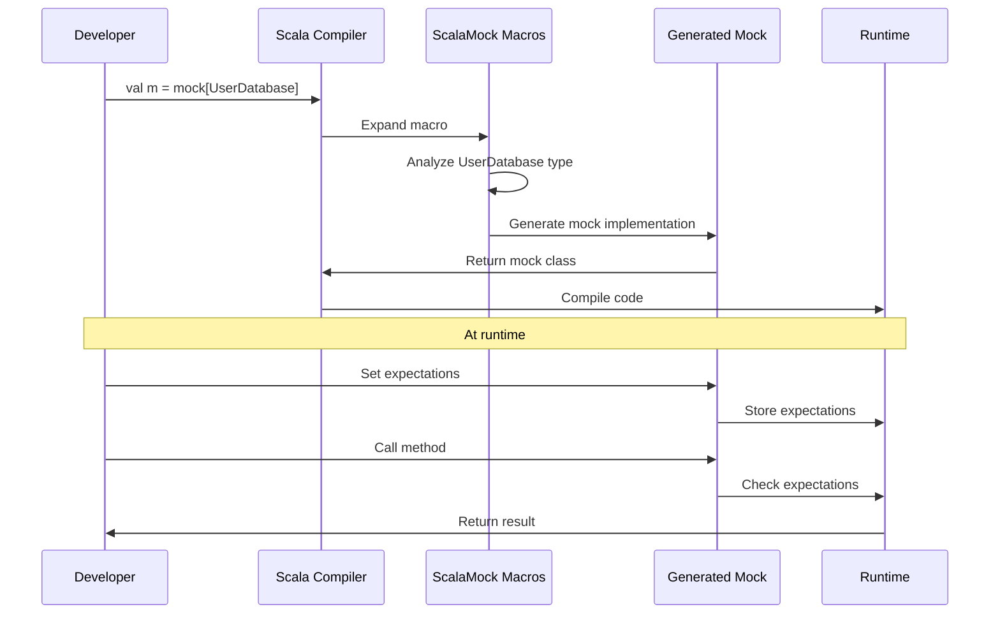

# Chapter 5: Typesafe Mocking

In the [previous chapter on Record-then-Verify Style](04_record_then_verify_style_.md), we explored how to set up return values first and verify interactions afterward. Now, let's dive into one of ScalaMock's most powerful features: Typesafe Mocking.

## The Power of Catching Errors Early

Imagine you're building a house. Would you rather discover a mistake in your blueprint before construction begins, or after you've already built the walls? In programming, finding errors at compile time rather than runtime follows the same principle - it saves time, effort, and potential disasters.

> **Typesafe mocking** means that ScalaMock uses Scala's powerful type system to catch errors during compilation rather than when your tests run.

This is like having a spell-checker that catches mistakes as you type, instead of discovering them after you've published your document.

## The Problem with Non-Typesafe Mocking

In many Java mocking frameworks (and some Scala ones), type errors might only be discovered when your tests run:

```java
// Java example with Mockito
TemperatureService mockService = mock(TemperatureService.class);
// Oops! Wrong type - should be double, not String
when(mockService.getTemperature("New York")).thenReturn("22.5");
// This compiles but fails at runtime!
```

This happens because these frameworks use strings or runtime reflection to identify methods, which can't be checked at compile time. ScalaMock takes a different approach.

## How ScalaMock Ensures Type Safety

ScalaMock leverages Scala's type system to ensure your mocks accurately represent the real objects they're replacing. Let's see a simple example:

```scala
import org.scalamock.scalatest.MockFactory
import org.scalatest.flatspec.AnyFlatSpec

trait TemperatureService {
  def getTemperature(city: String): Double
  def getForecast(days: Int): List[String]
}

class WeatherAppTest extends AnyFlatSpec with MockFactory {
  
  // Create a mock TemperatureService
  val mockService = mock[TemperatureService]
  
  "ScalaMock" should "catch type errors at compile time" in {
    // This works fine
    (mockService.getTemperature _).expects("New York").returning(22.5)
    
    // This would cause a compile error - wrong return type!
    // (mockService.getTemperature _).expects("New York").returning("22.5")
    
    // This would cause a compile error - wrong parameter type!
    // (mockService.getTemperature _).expects(42).returning(22.5)
  }
}
```

The commented lines would fail to compile - ScalaMock checks that:
1. Arguments match the expected parameter types
2. Return values match the method's return type
3. Method names and signatures match the original interface

## A Real-World Example

Let's see how typesafe mocking helps in a more realistic scenario with a user authentication system:

```scala
trait UserDatabase {
  def findUser(id: String): Option[User]
  def validateCredentials(username: String, password: String): Boolean
}

class AuthService(db: UserDatabase) {
  def authenticateUser(username: String, password: String): Boolean = {
    db.validateCredentials(username, password)
  }
  
  def getUserDetails(id: String): Option[User] = {
    db.findUser(id)
  }
}

case class User(id: String, name: String, email: String)

// Test code
"AuthService" should "authenticate valid users" in {
  val mockDb = mock[UserDatabase]
  
  // Set up expectations
  (mockDb.validateCredentials _)
    .expects("alice", "password123")
    .returning(true)
    
  val authService = new AuthService(mockDb)
  val result = authService.authenticateUser("alice", "password123")
  
  assert(result === true)
}
```

If we accidentally tried to set up our mock with incorrect types, ScalaMock would catch it:

```scala
// None of these would compile:

// Wrong parameter types
(mockDb.validateCredentials _).expects(123, "password123").returning(true)

// Wrong number of parameters
(mockDb.validateCredentials _).expects("alice").returning(true)

// Wrong return type
(mockDb.validateCredentials _).expects("alice", "password123").returning("yes")
```

## Supporting Scala's Advanced Type Features

ScalaMock's type safety goes beyond basic types. Let's explore how it handles Scala's more advanced type features.

### Polymorphic (Generic) Methods

ScalaMock fully supports methods with type parameters:

```scala
trait Repository {
  def get[T](id: String): Option[T]
  def save[T](item: T): Boolean
}

"Repository mock" should "support type parameters" in {
  val mockRepo = mock[Repository]
  
  // We can set expectations with specific type parameters
  (mockRepo.get[User] _).expects("user-123").returning(Some(User("user-123", "Alice", "alice@example.com")))
  (mockRepo.get[String] _).expects("setting-name").returning(Some("setting-value"))
  
  // And type-specific saves
  (mockRepo.save[User] _).expects(*).returning(true)
}
```

### Overloaded Methods

ScalaMock correctly handles overloaded methods with different parameter types:

```scala
trait Calculator {
  def add(a: Int, b: Int): Int
  def add(a: Double, b: Double): Double
  def add(numbers: List[Int]): Int
}

"Calculator mock" should "handle overloaded methods" in {
  val mockCalc = mock[Calculator]
  
  // Different overloads get different expectations
  (mockCalc.add(_: Int, _: Int)).expects(1, 2).returning(3)
  (mockCalc.add(_: Double, _: Double)).expects(1.5, 2.5).returning(4.0)
  (mockCalc.add(_: List[Int])).expects(List(1, 2, 3)).returning(6)
  
  // These all work without conflicts
  assert(mockCalc.add(1, 2) == 3)
  assert(mockCalc.add(1.5, 2.5) == 4.0)
  assert(mockCalc.add(List(1, 2, 3)) == 6)
}
```

Note the special syntax with explicit type annotations for overloaded methods.

### Operators and Special Method Names

Scala allows symbolic method names (operators). ScalaMock handles these gracefully:

```scala
trait Vector2D {
  def +(other: Vector2D): Vector2D
  def *(scalar: Double): Vector2D
}

case class Vector2DImpl(x: Double, y: Double) extends Vector2D {
  def +(other: Vector2D): Vector2D = 
    Vector2DImpl(x + other.asInstanceOf[Vector2DImpl].x, 
                 y + other.asInstanceOf[Vector2DImpl].y)
  
  def *(scalar: Double): Vector2D = 
    Vector2DImpl(x * scalar, y * scalar)
}

"Vector2D mock" should "support operator methods" in {
  val mockVector = mock[Vector2D]
  val v1 = Vector2DImpl(1.0, 2.0)
  val v2 = Vector2DImpl(3.0, 4.0)
  
  // We can mock operator methods
  (mockVector.+ _).expects(v1).returning(v2)
  (mockVector.* _).expects(2.0).returning(v1)
  
  assert(mockVector + v1 == v2)
  assert(mockVector * 2.0 == v1)
}
```

## How ScalaMock Works Under the Hood

To understand how ScalaMock achieves typesafe mocking, let's look at what happens behind the scenes:



When you write `mock[UserDatabase]`, ScalaMock uses Scala's macro system to:

1. Examine the `UserDatabase` trait at compile time
2. Generate an implementation class that matches all method signatures exactly
3. Create type-safe method handlers for setting expectations
4. Ensure all expectations match the original method signatures

This all happens during compilation, so any type mismatches are caught before your code even runs.

## The Magic: Scala Macros

ScalaMock uses Scala's powerful macro system to perform its typesafe magic. Here's a simplified view of what's happening:

```scala
// This is conceptual, not the actual implementation
def mock[T]: T = macro mockImpl[T]

def mockImpl[T: c.WeakTypeTag](c: Context): c.Expr[T] = {
  // Get the type T at compile time
  val tpe = weakTypeOf[T]
  
  // Find all abstract methods in the type
  val methods = tpe.declarations.collect {
    case m: MethodSymbol if m.isAbstract => m
  }
  
  // For each method, generate a typesafe implementation
  val methodImpls = methods.map { method =>
    val returnType = method.returnType
    val params = method.paramLists
    
    // Generate code that type-checks at compile time
    q"""
      def ${method.name}(...${params}): $returnType = {
        // Implementation that checks expectations and returns values
      }
    """
  }
  
  // Create a new class implementing T with these methods
  c.Expr[T](q"""
    new $tpe {
      ..$methodImpls
    }
  """)
}
```

This compile-time code generation ensures that the mock perfectly matches the interface of the original type, providing complete type safety.

## Benefits of Typesafe Mocking

Using ScalaMock's typesafe mocking provides several important benefits:

1. **Catch Errors Earlier**: Type errors are caught at compile time, not runtime
2. **Better IDE Support**: Your IDE can provide code completion and type hints
3. **Safer Refactoring**: Changing method signatures will immediately highlight broken tests
4. **More Reliable Tests**: No risk of runtime type mismatches
5. **Documentation Through Types**: Your tests clearly show expected types

## Common Typesafe Mocking Challenges

### Challenge: Explicit Type Annotations for Overloaded Methods

When mocking overloaded methods, you may need to be explicit about types:

```scala
trait Service {
  def process(data: String): String
  def process(data: Int): Int
}

val mockService = mock[Service]

// This would be ambiguous
// (mockService.process _).expects(*)

// Be explicit with type annotations
(mockService.process(_: String)).expects(*).returning("processed")
(mockService.process(_: Int)).expects(*).returning(42)
```

### Challenge: Working with Type Constraints

ScalaMock handles methods with type constraints as well:

```scala
trait Repository {
  def find[T <: Entity](id: String): Option[T]
}

trait Entity {
  def id: String
}

case class User(id: String, name: String) extends Entity
case class Product(id: String, price: Double) extends Entity

"Repository" should "respect type constraints" in {
  val mockRepo = mock[Repository]
  
  val user = User("u1", "Alice")
  (mockRepo.find[User] _).expects("u1").returning(Some(user))
  
  // This would fail if Dog doesn't extend Entity
  // (mockRepo.find[Dog] _).expects("d1").returning(Some(Dog("d1", "Fido")))
}
```

## Comparing ScalaMock with Other Frameworks

Here's how ScalaMock's typesafe mocking compares to other frameworks:

| Feature | ScalaMock | Mockito | EasyMock | PowerMock |
|---------|-----------|---------|----------|-----------|
| Compile-time type checking | ✅ | ❌ | ❌ | ❌ |
| Support for Scala types | ✅ | Partial | Partial | Partial |
| Polymorphic methods | ✅ | Limited | Limited | Limited |
| Symbolic methods | ✅ | ❌ | ❌ | ❌ |
| Type constraints | ✅ | ❌ | ❌ | ❌ |

## Real-World Example: Weather API Client

Let's put it all together with a more complete example. Imagine we're testing a weather API client:

```scala
// Our domain models
case class Location(lat: Double, lon: Double)
case class Temperature(value: Double, unit: String)
case class WeatherForecast(temperature: Temperature, conditions: String)

// The API client interface
trait WeatherApiClient {
  def getCurrentWeather(location: Location): WeatherForecast
  def getHourlyForecast(location: Location, hours: Int): List[WeatherForecast]
  def getTemperature[T](location: Location)(implicit converter: TemperatureConverter[T]): T
}

// Type class for temperature conversion
trait TemperatureConverter[T] {
  def convert(temp: Temperature): T
}

// Our weather service that uses the API client
class WeatherService(apiClient: WeatherApiClient) {
  def getFormattedWeather(lat: Double, lon: Double): String = {
    val location = Location(lat, lon)
    val weather = apiClient.getCurrentWeather(location)
    s"${weather.temperature.value}°${weather.temperature.unit} and ${weather.conditions}"
  }
}
```

Now let's test it with ScalaMock's typesafe mocking:

```scala
"WeatherService" should "format the current weather correctly" in {
  val mockApiClient = mock[WeatherApiClient]
  
  // Set up our expectation
  (mockApiClient.getCurrentWeather _)
    .expects(Location(40.7, -74.0))
    .returning(WeatherForecast(Temperature(22.5, "C"), "Sunny"))
  
  val weatherService = new WeatherService(mockApiClient)
  val result = weatherService.getFormattedWeather(40.7, -74.0)
  
  assert(result === "22.5°C and Sunny")
}
```

The typesafe nature of ScalaMock ensures that:
- We're passing the correct types to `getCurrentWeather`
- The return type matches `WeatherForecast`
- All the nested types (like `Temperature`) are correct

If we make any type mistakes, the compiler will catch them:

```scala
// None of these would compile:

// Wrong parameter type
(mockApiClient.getCurrentWeather _).expects("New York").returning(...)

// Wrong return type
(mockApiClient.getCurrentWeather _).expects(Location(40.7, -74.0)).returning("Nice weather!")

// Wrong nested type
(mockApiClient.getCurrentWeather _)
  .expects(Location(40.7, -74.0))
  .returning(WeatherForecast("22.5°C", "Sunny")) // Temperature should be a case class, not String
```

## Conclusion

ScalaMock's typesafe mocking is like having a safety net that catches errors before they can cause problems. By leveraging Scala's powerful type system, ScalaMock helps ensure that your mocks accurately represent the components they're replacing, catching potential issues at compile time rather than runtime.

This typesafe approach:
- Makes your tests more reliable
- Catches errors earlier in the development process
- Provides better IDE support for writing tests
- Makes refactoring safer by ensuring mocks stay in sync with interfaces

In the next chapter, [Testing Framework Integration](06_testing_framework_integration_.md), we'll explore how ScalaMock integrates with popular testing frameworks like ScalaTest and Specs2, providing even more powerful tools for writing effective tests.

---

Generated by [AI Codebase Knowledge Builder](https://github.com/The-Pocket/Tutorial-Codebase-Knowledge)
