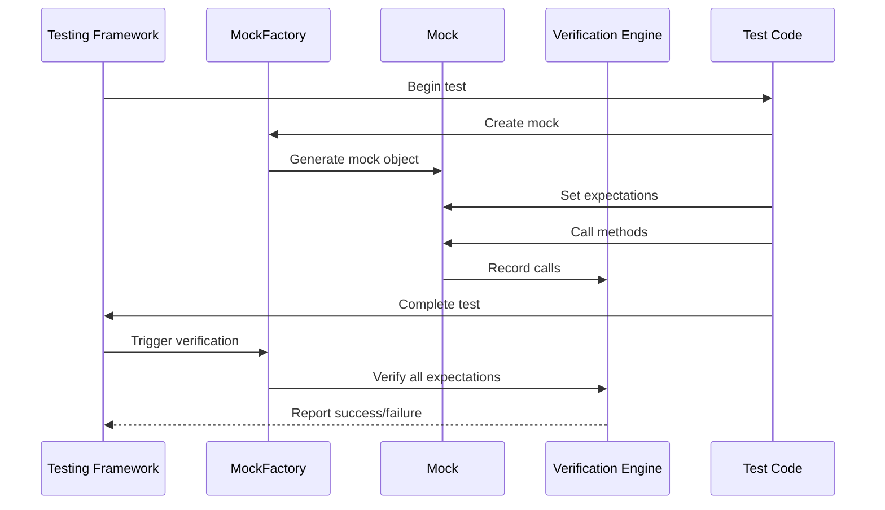

# Chapter 6: Testing Framework Integration

In the [previous chapter on Typesafe Mocking](05_typesafe_mocking_.md), we explored how ScalaMock uses Scala's type system to catch errors at compile time. Now, let's see how ScalaMock works with popular testing frameworks to make your testing experience smooth and natural.

## The Power of Integration

Imagine you've just bought a fantastic new speaker system, but when you get home, you discover it doesn't connect to any of your devices! Similarly, a mocking library isn't very useful if it doesn't work well with your testing framework.

> **Testing Framework Integration** allows ScalaMock to fit seamlessly into your existing testing workflow, whether you're using ScalaTest, Specs2, or another framework.

It's like having the right adapter for any outlet – ScalaMock adapts to your framework of choice, so you can focus on writing tests rather than figuring out how to make tools work together.

## Why Integration Matters

Without proper integration:
- You'd need to handle setup and teardown of mock objects yourself
- You might lose helpful error messages when tests fail
- Test code could become cluttered with boilerplate

With ScalaMock's framework integration:
- Mocks are automatically verified at the end of each test
- Error messages are tailored to your testing framework
- You get traits and base classes designed for your specific framework

## ScalaMock with ScalaTest

[ScalaTest](https://www.scalatest.org/) is one of the most popular testing frameworks for Scala. Here's how to use ScalaMock with it:

### Setup

First, make sure you have the right dependencies:

```scala
// In build.sbt
libraryDependencies ++= Seq(
  "org.scalamock" %% "scalamock" % "5.2.0" % Test,
  "org.scalatest" %% "scalatest" % "3.2.9" % Test
)
```

### Basic Integration

The simplest way to use ScalaMock with ScalaTest is to mix in the `MockFactory` trait:

```scala
import org.scalatest.flatspec.AnyFlatSpec
import org.scalamock.scalatest.MockFactory

class WeatherServiceTest extends AnyFlatSpec with MockFactory {
  
  "WeatherService" should "return the current temperature" in {
    // Your test with mocks here
  }
}
```

By extending `MockFactory`, you get all the mocking functionality integrated with ScalaTest's test lifecycle. ScalaMock will automatically verify all expectations at the end of each test.

### A Complete Example

Let's test a simple weather application:

```scala
// Our domain classes
trait WeatherApi {
  def getTemperature(city: String): Double
  def getForecast(city: String): List[String]
}

class WeatherService(api: WeatherApi) {
  def getWeatherReport(city: String): String = {
    val temp = api.getTemperature(city)
    val forecast = api.getForecast(city)
    
    s"Current temperature in $city: $temp°C\nForecast: ${forecast.mkString(", ")}"
  }
}
```

Now, let's write a test using ScalaTest and ScalaMock:

```scala
import org.scalatest.flatspec.AnyFlatSpec
import org.scalatest.matchers.should.Matchers
import org.scalamock.scalatest.MockFactory

class WeatherServiceTest extends AnyFlatSpec with Matchers with MockFactory {
  
  "WeatherService" should "generate a weather report" in {
    // Create the mock
    val mockApi = mock[WeatherApi]
    
    // Set expectations
    (mockApi.getTemperature _).expects("London").returning(21.0)
    (mockApi.getForecast _).expects("London").returning(List("Sunny", "Cloudy", "Rain"))
    
    // Create the service with our mock
    val service = new WeatherService(mockApi)
    
    // Exercise the code
    val report = service.getWeatherReport("London")
    
    // Verify the result
    report should be("Current temperature in London: 21.0°C\nForecast: Sunny, Cloudy, Rain")
  }
}
```

What's happening here:
1. We extend both `Matchers` (for ScalaTest assertions) and `MockFactory` (for ScalaMock)
2. We create a mock `WeatherApi` and set expectations
3. We use our mock in the `WeatherService`
4. ScalaMock automatically verifies all expectations at the end of the test

### Different ScalaTest Styles

ScalaTest supports multiple testing styles. ScalaMock works with all of them:

```scala
// FunSpec style
import org.scalatest.funspec.AnyFunSpec

class WeatherFunSpec extends AnyFunSpec with MockFactory {
  describe("WeatherService") {
    it("should generate a weather report") {
      val mockApi = mock[WeatherApi]
      // Test code here...
    }
  }
}

// WordSpec style
import org.scalatest.wordspec.AnyWordSpec

class WeatherWordSpec extends AnyWordSpec with MockFactory {
  "WeatherService" when {
    "asked for a report" should {
      "generate a weather report" in {
        val mockApi = mock[WeatherApi]
        // Test code here...
      }
    }
  }
}
```

## ScalaMock with Specs2

[Specs2](https://etorreborre.github.io/specs2/) is another popular testing framework for Scala. ScalaMock integrates with it just as easily:

### Setup

Add the dependencies:

```scala
// In build.sbt
libraryDependencies ++= Seq(
  "org.scalamock" %% "scalamock" % "5.2.0" % Test,
  "org.specs2" %% "specs2-core" % "4.13.1" % Test
)
```

### Basic Integration

For Specs2, mix in the `MockFactory` trait:

```scala
import org.specs2.mutable.Specification
import org.scalamock.specs2.MockContext

class WeatherServiceSpec extends Specification with MockContext {
  
  "WeatherService" should {
    "generate a weather report" in {
      // Your test with mocks here
    }
  }
}
```

### A Complete Example

Let's test our weather application with Specs2:

```scala
import org.specs2.mutable.Specification
import org.scalamock.specs2.MockContext

class WeatherServiceSpec extends Specification with MockContext {
  
  "WeatherService" should {
    "generate a weather report" in {
      // Create the mock
      val mockApi = mock[WeatherApi]
      
      // Set expectations
      (mockApi.getTemperature _).expects("London").returning(21.0)
      (mockApi.getForecast _).expects("London").returning(List("Sunny", "Cloudy", "Rain"))
      
      // Create the service with our mock
      val service = new WeatherService(mockApi)
      
      // Exercise the code
      val report = service.getWeatherReport("London")
      
      // Verify the result
      report must be_==("Current temperature in London: 21.0°C\nForecast: Sunny, Cloudy, Rain")
    }
  }
}
```

The pattern is similar to ScalaTest, but we use Specs2's assertion syntax (`must be_==` instead of `should be`).

## Understanding the Differences

There are slight differences in how ScalaMock integrates with each framework:

```scala
// ScalaTest
class MyScalaTest extends AnyFlatSpec with MockFactory {
  // MockFactory trait provides all mocking functionality
}

// Specs2
class MySpecs2Test extends Specification with MockContext {
  // MockContext provides access to the mock factory
}
```

For Specs2, the `MockContext` trait provides a fresh mock context for each example, ensuring that expectations don't leak between tests.

## How It Works Under the Hood

When you use ScalaMock with a testing framework, several interactions happen behind the scenes:



The key to this integration is that ScalaMock hooks into the lifecycle of your testing framework:

1. When a test starts, ScalaMock prepares a new context for mocks
2. When you create mocks and set expectations, they're registered with this context
3. When the test ends, ScalaMock automatically verifies all expectations
4. Any failures are reported in a format that works with your testing framework

## The Internal Implementation

Inside ScalaMock, the framework integration is implemented with traits that adapt to each testing framework. Let's look at a simplified version:

For ScalaTest:
```scala
// Simplified internal implementation
trait MockFactory {
  private val mockContext = new MockContext()
  
  // Called by ScalaTest after each test
  abstract override def withFixture(test: NoArgTest): Outcome = {
    val outcome = super.withFixture(test)
    
    // Verify all expectations after the test runs
    try {
      mockContext.validateExpectations()
      outcome
    } catch {
      case e: ExpectationException => Failed(e)
    }
  }
  
  // Methods for creating mocks
  def mock[T]: T = mockContext.mock[T]
  def stub[T]: T = mockContext.stub[T]
  // ...
}
```

For Specs2:
```scala
// Simplified internal implementation
trait MockContext extends org.specs2.specification.Before {
  private val mockContext = new org.scalamock.context.MockContext()
  
  // Called by Specs2 before each test
  def before: Any = {
    // Create a fresh context for each test
    mockContext.reset()
  }
  
  // Called by Specs2 after each test
  def after: Any = {
    // Verify all expectations
    mockContext.validateExpectations()
  }
  
  // Methods for creating mocks
  def mock[T]: T = mockContext.mock[T]
  def stub[T]: T = mockContext.stub[T]
  // ...
}
```

These integrations ensure that mocks are properly set up before each test and verified after each test, with failures reported in a way that makes sense for the testing framework.

## Using Both Styles with Framework Integration

Both [Expectations-First Style](03_expectations_first_style_.md) and [Record-then-Verify Style](04_record_then_verify_style_.md) work seamlessly with the framework integrations:

```scala
// Expectations-First Style with ScalaTest
"WeatherService" should "work with expectations-first style" in {
  val mockApi = mock[WeatherApi]
  
  // Set expectations first
  (mockApi.getTemperature _).expects("London").returning(21.0)
  
  // Exercise code
  val service = new WeatherService(mockApi)
  service.getWeatherReport("London")
  
  // No explicit verification needed
}

// Record-then-Verify Style with ScalaTest
"WeatherService" should "work with record-then-verify style" in {
  val stubApi = stub[WeatherApi]
  
  // Set up return values
  (stubApi.getTemperature _).when("London").returns(21.0)
  (stubApi.getForecast _).when("London").returns(List("Sunny"))
  
  // Exercise code
  val service = new WeatherService(stubApi)
  service.getWeatherReport("London")
  
  // Explicit verification
  (stubApi.getTemperature _).verify("London")
  (stubApi.getForecast _).verify("London")
}
```

Both styles benefit from the testing framework integration, with automatic verification and clean error reporting.

## A Real-World Example: Database-Backed User Service

Let's look at a more realistic example with multiple dependencies:

```scala
// Our application classes
case class User(id: String, name: String, email: String)

trait UserDatabase {
  def findUser(id: String): Option[User]
  def saveUser(user: User): Boolean
}

trait EmailService {
  def sendWelcomeEmail(email: String, name: String): Boolean
}

class UserService(db: UserDatabase, emailService: EmailService) {
  def createUser(id: String, name: String, email: String): Boolean = {
    val user = User(id, name, email)
    val saved = db.saveUser(user)
    
    if (saved) {
      emailService.sendWelcomeEmail(email, name)
      true
    } else {
      false
    }
  }
  
  def getUser(id: String): Option[User] = {
    db.findUser(id)
  }
}
```

Now, let's test this with ScalaTest and ScalaMock:

```scala
import org.scalatest.flatspec.AnyFlatSpec
import org.scalatest.matchers.should.Matchers
import org.scalamock.scalatest.MockFactory

class UserServiceTest extends AnyFlatSpec with Matchers with MockFactory {
  
  "UserService" should "create a user and send welcome email" in {
    // Create mocks
    val mockDb = mock[UserDatabase]
    val mockEmail = mock[EmailService]
    
    // User data
    val userId = "user123"
    val userName = "Alice"
    val userEmail = "alice@example.com"
    val user = User(userId, userName, userEmail)
    
    // Set expectations
    (mockDb.saveUser _).expects(user).returning(true)
    (mockEmail.sendWelcomeEmail _).expects(userEmail, userName).returning(true)
    
    // Create service and exercise code
    val service = new UserService(mockDb, mockEmail)
    val result = service.createUser(userId, userName, userEmail)
    
    // Verify result
    result should be(true)
    // No need to verify mocks - ScalaMock does it automatically
  }
  
  it should "handle database failures when creating users" in {
    // Create mocks
    val mockDb = mock[UserDatabase]
    val mockEmail = mock[EmailService]
    
    // User data
    val userId = "user456"
    val userName = "Bob"
    val userEmail = "bob@example.com"
    val user = User(userId, userName, userEmail)
    
    // Set expectations - database fails to save
    (mockDb.saveUser _).expects(user).returning(false)
    // Email should NOT be sent - no expectation needed
    
    // Create service and exercise code
    val service = new UserService(mockDb, mockEmail)
    val result = service.createUser(userId, userName, userEmail)
    
    // Verify result
    result should be(false)
    // No need to verify mocks - ScalaMock does it automatically
  }
}
```

Thanks to ScalaMock's integration with ScalaTest:
1. Each test has its own mock context
2. All mock expectations are verified automatically at the end of each test
3. Any verification failures are reported as ScalaTest test failures
4. No boilerplate code is needed for setup or teardown

## Common Gotchas and Solutions

### Gotcha 1: Forgetting to Mix In the Right Trait

```scala
// Missing MockFactory - tests will compile but mocking won't work
class BrokenTest extends AnyFlatSpec {
  "My test" should "work" in {
    val mockApi = mock[WeatherApi] // This will fail!
  }
}

// Fixed version
class FixedTest extends AnyFlatSpec with MockFactory {
  "My test" should "work" in {
    val mockApi = mock[WeatherApi] // This works!
  }
}
```

### Gotcha 2: Expecting Verification in the Wrong Place

```scala
// Incorrect - manually verifying when it's automatic
it should "create a user" in {
  val mockDb = mock[UserDatabase]
  (mockDb.saveUser _).expects(user).returning(true)
  
  // Test code...
  
  // Unnecessary - ScalaMock already verifies automatically
  // mockDb.verify() - this doesn't exist and isn't needed
}
```

### Gotcha 3: Mixing Different Framework Traits

```scala
// Incorrect - mixing ScalaTest and Specs2 traits
class MixedTest extends AnyFlatSpec with org.scalamock.specs2.MockContext {
  // This will cause conflicts!
}

// Correct - use the right trait for your framework
class ScalaTestExample extends AnyFlatSpec with MockFactory {
  // For ScalaTest
}

class Specs2Example extends Specification with org.scalamock.specs2.MockContext {
  // For Specs2
}
```

## Conclusion

ScalaMock's testing framework integration makes it feel like a natural extension of your testing framework, whether you're using ScalaTest, Specs2, or another supported framework. This integration streamlines your testing workflow by automatically handling mock verification and providing framework-specific error reporting.

By mixing in the right traits, you get:
- Automatic verification at the end of each test
- Framework-specific error reporting
- A clean, concise testing experience

In the next chapter, [Alternative API](07_alternative_api_.md), we'll explore ScalaMock's newer, more concise API style that offers an alternative approach to setting up mocks and verifying interactions.

Happy testing!

---

Generated by [AI Codebase Knowledge Builder](https://github.com/The-Pocket/Tutorial-Codebase-Knowledge)
