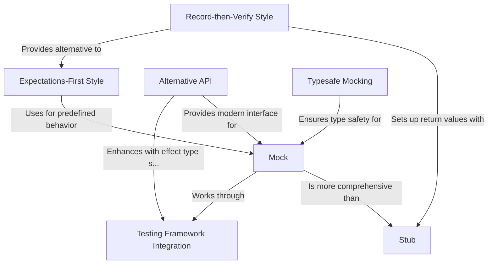

# Tutorial: ScalaMock

ScalaMock is a **native Scala mocking framework** for software testing. It enables developers to create *simulated objects* that mimic real components, helping isolate and test specific parts of applications. The framework offers both **Expectations-First** style (where you define behavior before running tests) and **Record-then-Verify** style (similar to Mockito). ScalaMock stands out with its *typesafe mocking* that maintains Scala's compile-time type checking and seamless integration with popular testing frameworks like ScalaTest and Specs2. The newer **Alternative API** provides a more concise syntax and better support for functional programming paradigms.

**Source Repository:** [None](None)

## Chapters

1. [Mock
](01_mock_.md)
2. [Stub
](02_stub_.md)
3. [Expectations-First Style
](03_expectations_first_style_.md)
4. [Record-then-Verify Style
](04_record_then_verify_style_.md)
5. [Typesafe Mocking
](05_typesafe_mocking_.md)
6. [Testing Framework Integration
](06_testing_framework_integration_.md)
7. [Alternative API
](07_alternative_api_.md)

---

Generated by [AI Codebase Knowledge Builder](https://github.com/The-Pocket/Tutorial-Codebase-Knowledge)